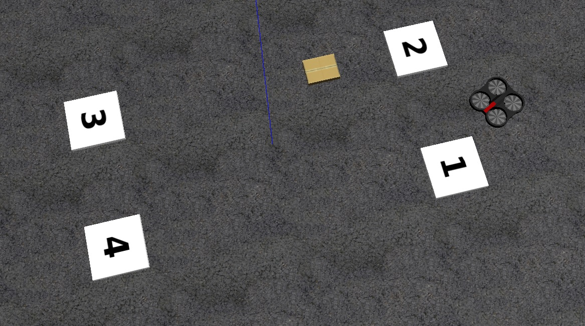
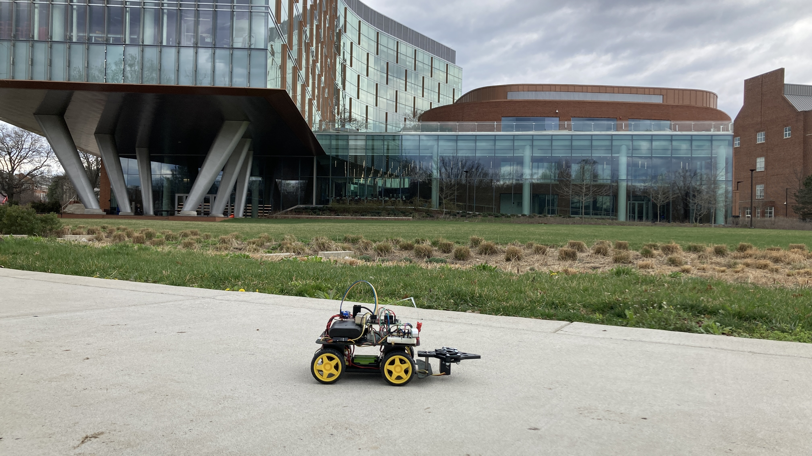
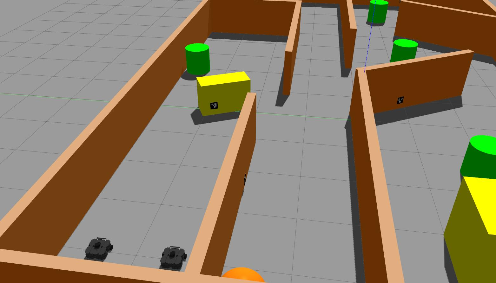
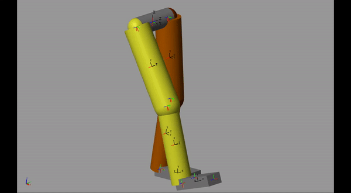
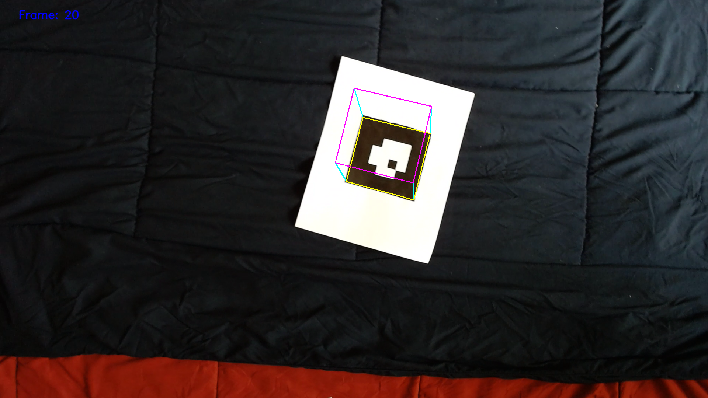
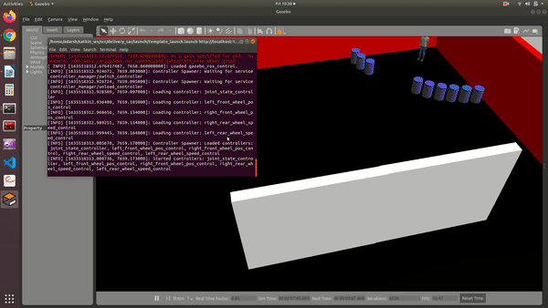
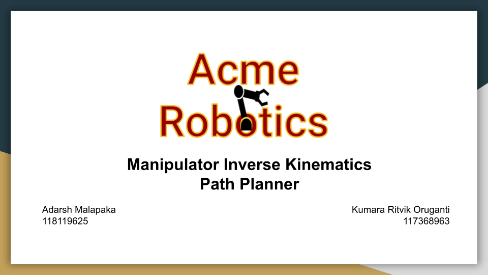
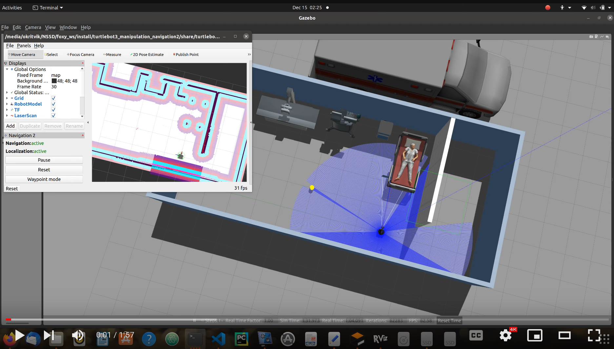
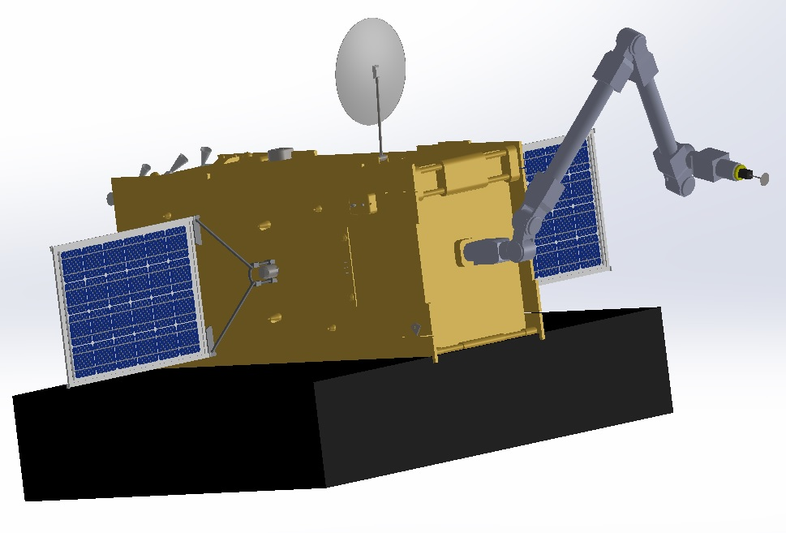

<!--  -->

    

    

      

    

  

</img>
&nbsp; &nbsp; &nbsp; &nbsp; &nbsp; &nbsp;
</img>
&nbsp; &nbsp; &nbsp; &nbsp; &nbsp; &nbsp;
</img>
&nbsp; &nbsp; &nbsp; &nbsp; &nbsp; &nbsp;
</img>
&nbsp; &nbsp; &nbsp; &nbsp; &nbsp; &nbsp;
</img>

<!-- 

Robots &nbsp; &nbsp; &nbsp; &nbsp; &nbsp; &nbsp; &nbsp; &nbsp; &nbsp; &nbsp; &nbsp; &nbsp; &nbsp; &nbsp; Movies &nbsp; &nbsp; &nbsp; &nbsp; &nbsp; &nbsp; &nbsp; &nbsp; &nbsp; &nbsp; &nbsp; &nbsp; &nbsp; Football &nbsp; &nbsp; &nbsp; &nbsp; &nbsp; &nbsp; &nbsp; &nbsp; &nbsp; &nbsp; &nbsp; &nbsp; Music &nbsp; &nbsp; &nbsp; &nbsp; &nbsp; &nbsp; &nbsp; &nbsp; &nbsp; &nbsp; &nbsp; &nbsp; &nbsp; Trains

 -->

Robots, Movies, Football, Music, and Trains.

    </img>
    &nbsp; &nbsp;
    </img> 

    The body is near Washington D.C, but the mind is in Chennai, India.

<!-- <a href="https://www.vecteezy.com/free-vector/washington-dc">Washington Dc Vectors by Vecteezy</a> -->

  

    

<!--      -->

    
    

<!-- 🎓 &nbsp; Bachelor of Technology (Electrical & Electronics Engineering) from **National Institute of Technology Karnataka (NITK)**, Surathkal, India. -->

## 🛠 &nbsp; Technologies

    <a href="https://www.linux.org/" target="_blank" rel="noreferrer"> 
     &nbsp
    
     &nbsp
      
     &nbsp
     
     &nbsp
     
     &nbsp
      
      &nbsp
       
       &nbsp
        
     &nbsp
     
     &nbsp
      
    &nbsp
     
     &nbsp
    
     &nbsp
        
     &nbsp
     

    

                   

## :clamp: &nbsp; Projects
[</img>](https://github.com/adarshmalapaka/ardrone-potential-field-controller)
[</img>](https://github.com/adarshmalapaka/autonomous-robotics)
[</img>](https://github.com/adarshmalapaka/Simplified-Urban-Search-and-Rescue-Operation)
</img>
[</img>](https://github.com/adarshmalapaka/ar-tag-virtual-cube)
[</img>](https://github.com/adarshmalapaka/delivery-car)
[</img>](https://github.com/adarshmalapaka/ground-plane-segmentation)
[</img>](https://github.com/adarshmalapaka/Acme-Manipulator-IK-Solver)
[</img>](https://github.com/adarshmalapaka/MARIO-COM)
[</img>](https://www.youtube.com/watch?v=dmlCHqx8rUM)
[</img>](https://github.com/adarshmalapaka/voxl_offboard)
[</img>](https://github.com/adarshmalapaka/satellite-servicer)
